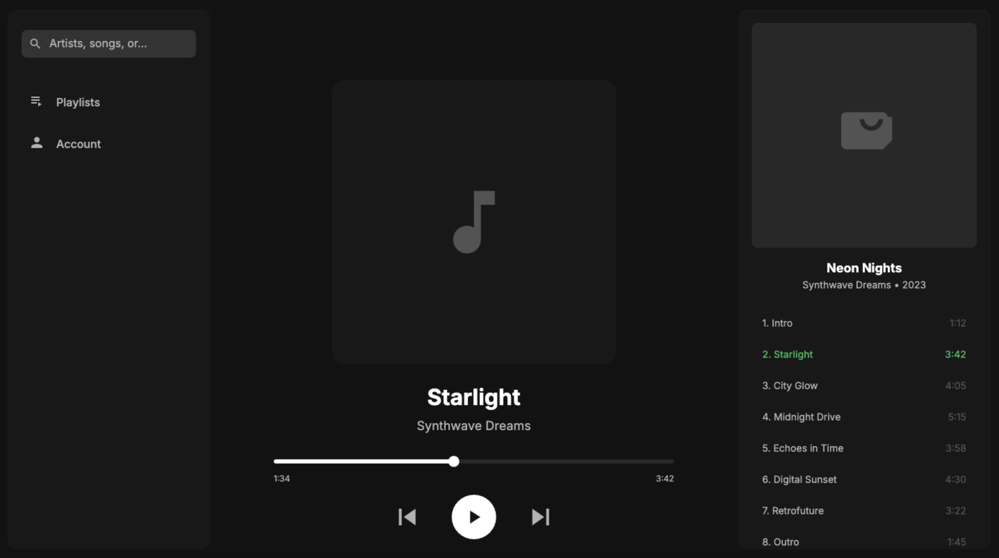

# LiteUX

LiteUX is an AI-powered tool which creates modern UX designs using HTML Canvas.

##### *A Music app UX design made using LiteUX*

---

### Steps to use:
1. Clone the repository
2. Open Terminal in the repository directory
3. Install the required Python dependencies using `pip3 install -r requirements.txt`
4. Get a **free** Gemini API Key from https://aistudio.google.com and copy it
5. Return to the terminal and set the environment variable "API_KEY" to the API Key you just created
6. Relaunch the terminal in the repository directory
7. Run `python3 main.py`

### Requirements:
1. Python
2. Colorama (Python Package)
3. requests (Python Package)
